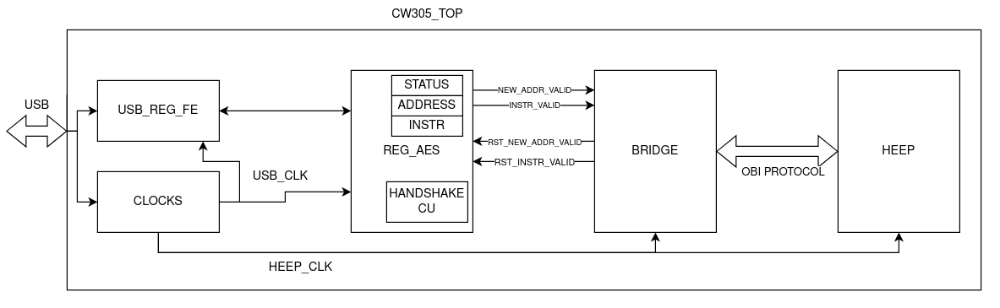

# CW305-HEEP with loosely coupled accelerator
In this branch the [`X-HEEP`](https://github.com/esl-epfl/x-heep) microcontroller is extedend with a loosely-coupled memory-mapped accelerator. 
The accelerator is an HW implementation of [`Keccak`](https://github.com/vlsi-lab/keccak_integration/tree/keccak_xheep) 

The microcontroller with the Keccak accelerator is then ported on the [`ChipWhisperer`](https://github.com/newaetech/chipwhisperer/tree/develop) CW305 board for side-channel attack research on the RISC-V platfo

The idea is to exploit the infrastructure provided by Chipwhisperer to carry out side-channel attacks on a `RISC-V` architecture-based microcontroller in order to determine the most vulnerable areas and possibly develop hardware countermeasures. Since `X-HEEP` supports different boot modes, a hardware bridge was developed to load instructions into the RAM of the microcontroller when the JTAG mode is selected without the need for a JTAG programmer. The bridge is also responsible for interfacing `X-HEEP` with the register module used by the Chipwhisperer API, since the two blocks work with two different clock domains. A schematic of the structure is shown below:

<p align="center"></p>

This repository supports both simulation with `Verilator` and synthesis with `Vivado`.

# Setup
This project relies on the `X-HEEP` toolchain. Please refer to [Read the docs - Getting Started](https://x-heep.readthedocs.io/en/latest/GettingStarted/Setup.html). The docker solution is recommended, since it is the one used for the project developement.

Preferred `X-HEEP` toolchain image:

```
docker pull ghcr.io/vlsi-lab/x-heep-toolchain:latest
```

`Vivado` design tool is required for synthesis on Xilinx FPGAs. Make sure Xilinx cable drivers are installed. Set up the Vivado environments before executing the syntesis by running:

```
source <vivado-installation-path>/settings64.sh
```

For what concerns the synthesis, it is required to install `conda` on the local machine, since `Vivado` is not available inside the container image and it relies on the `core-v-mini-mcu` environement.

```
conda activate core-v-mini-mcu
```

# Microcontroller generation and initialization
`CW305-HEEP` generation is automated by means of a Python script. Some design parameters can be adjusted to user preferences, as described in [Read the docs - Generating the MCU](https://x-heep.readthedocs.io/en/latest/GettingStarted/GeneratingMCU.html).

```
make gr-heep-gen
```

To regenerate only the microcontroller:

```
make mcu-gen
```

# Compiling applications
All software applications can be found in `sw/applications`. The compiler will search also in `hw/vendor/x-heep/sw/applications` if the specified application is not available in said folder. Please refer to [Read the docs - Compiling applications](https://x-heep.readthedocs.io/en/latest/How_to/CompileApps.html) for all the details on compilation.

Without specifications, a simple `hello world` program will be compiled by running:

```
make app
```

In order to compile a different program:
```
make app PROJECT=<name_of_the_application>
```

The `sw/applications` folder can be expanded as described in [Read the Docs - Extending Software](https://x-heep.readthedocs.io/en/latest/Extending/eXtendingSW.html).

# Simulation
To only build the simulation environement:

```
make verilator-build
```

To build the environement and run the simulation:

```
make verilator-sim
```

To just run the simulation:

```
make verilator-run
```
Note: for the simulation purposes, all the `printf` statements are translated to UART calls. The output text is written to `build/polito_cw305_heep_cw305_heep_0.0.1/sim-verilator/uart.log` and automatically displayed when the previous two commands are executed.

To run the simulation without without waveform dumping (faster):

```
make verilator-opt
```

To show the simulation waveforms using `gtkwave`:

```
make verilator-waves
```

# Synthesis
Synthesis can be performed automatically using `Vivado`:

```
make vivado-fpga
```

The synthesis also supports `ILA` (Integrated Logic Analizer). For example purposes, an `ILA` instance is placed between the `bridge` and `X-HEEP` during the synthesis by default. It can be used to monitor the communication between these two modules.

The generated bitsream can be found at `build/polito_cw305_heep_cw305_heep_0.0.1/cw305-vivado/polito_cw305_heep_cw305_heep_0.0.1.runs/impl_1/cw305_top.bit`

# Cleaning
To clean the build folder:

```
make clean
```

Afted this command is executed, it is needed to regenerate the microcontroller, compile the application and build the simulation environement.
